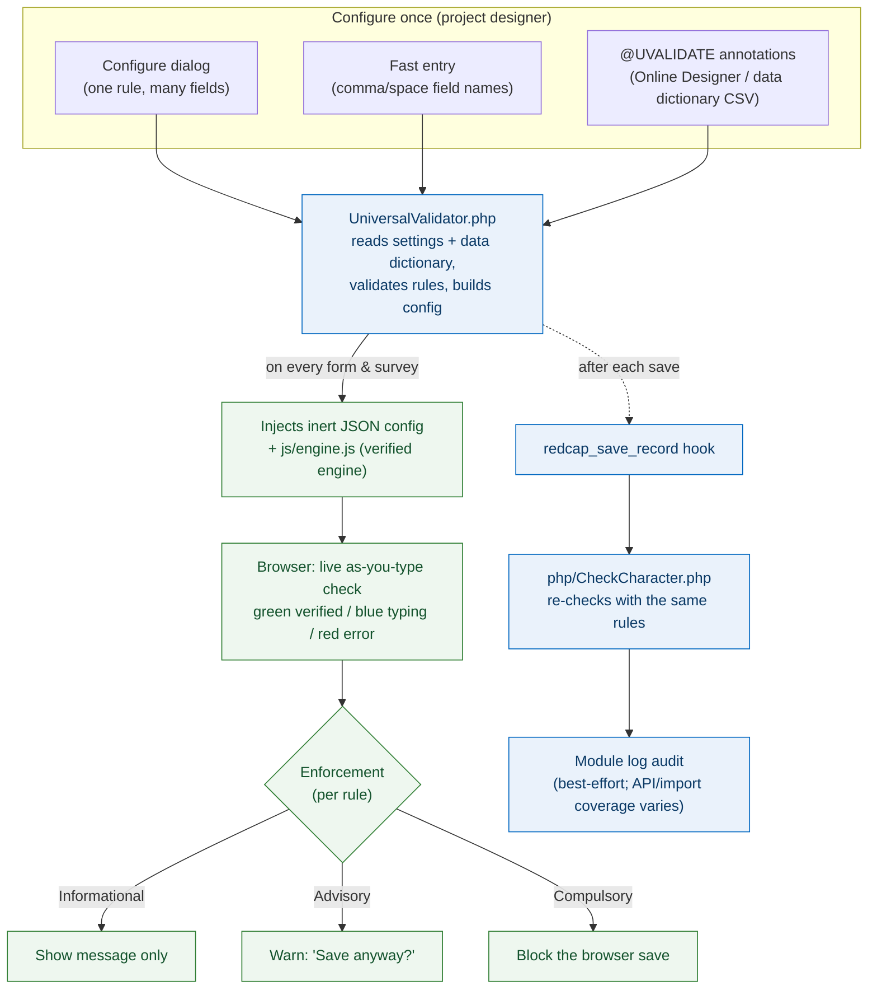

# Universal Regex & Check-Character Validator — User & Training Guide

A hands-on guide to validating IDs, codes, and structured text in REDCap with the
**Universal Regex & Check-Character Validator** external module (v0.8.0). It catches a mistyped
participant ID, a mis-scanned specimen barcode, or an off-format lab number while
the person who typed it is still looking at the field — before the bad value ever
reaches your dataset.

This guide is written as training content: each Part stands on its own and maps
to one slide group, so it doubles as the script for a presentation.

---

## Who this guide is for

| You are… | Read | Start at |
|---|---|---|
| A **REDCap administrator** installing the module on the server | Parts 1, 2, 7 | [Part 2](#part-2-install-and-enable-the-module) |
| A **project designer / data manager** writing validation rules | Parts 1, 3, 4, 6, 8 | [Part 3](#part-3-configure-validation-rules) |
| **Data-entry staff or a survey respondent** who just wants to know what the messages mean | Parts 1, 5 | [Part 5](#part-5-what-the-person-entering-data-sees) |

## Contents

- [Part 1: Core concepts](#part-1-core-concepts)
- [Part 2: Install and enable the module](#part-2-install-and-enable-the-module)
- [Part 3: Configure validation rules](#part-3-configure-validation-rules)
- [Part 4: Validation scenarios](#part-4-validation-scenarios)
- [Part 5: What the person entering data sees](#part-5-what-the-person-entering-data-sees)
- [Part 6: Format patterns and safety](#part-6-format-patterns-and-safety)
- [Part 7: Server-side audit and privacy](#part-7-server-side-audit-and-privacy)
- [Part 8: Troubleshooting and FAQ](#part-8-troubleshooting-and-faq)
- [Appendix A: Algorithm reference](#appendix-a-algorithm-reference)
- [Appendix B: Algorithm shorthands](#appendix-b-algorithm-shorthands)
- [Appendix C: Rule option reference](#appendix-c-rule-option-reference)
- [Appendix D: Safe vs risky patterns](#appendix-d-safe-vs-risky-patterns)
- [Appendix E: Copy-paste cheat sheet](#appendix-e-copy-paste-cheat-sheet)

---

## Part 1: Core concepts

### The problem it solves

REDCap's stock validation checks *shape* — is this a date, a number, an email?
It cannot tell that `TB-004821` was meant to be `TB-004822`, because both are
valid-looking text. In a multi-site study those single-character slips turn into
hours of reconciliation: specimens that cannot be matched to a participant,
duplicate records, lab results filed against the wrong ID.

This module adds two kinds of checking that stock REDCap does not:

1. **Check-character validation** — many IDs are minted with a trailing
   *check character* computed from the rest of the ID. Recomputing it catches
   almost every single-character typo and digit swap, including the ones a
   format check can never see (a `3` typed as an `8` keeps the same shape).
2. **Format (regex) validation set per rule** — a project designer defines the
   exact shape of a code (`FC` + four digits, a six-digit sequence, a year), and
   typists get progressive "what's still missing" guidance as they type. In
   stock REDCap a custom regex type has to be added server-wide by an admin; here
   it is a per-rule setting.

Both run live in the browser, and both are re-checked on the server after save.

### Vocabulary

- **Check character** — the last one or two characters of an ID, derived by an
  algorithm (ISO 7064, Damm, Verhoeff, Luhn, and the weighted schemes) from
  everything before it. Change any character and the check no longer matches.
- **Payload** — the part of the ID the algorithm runs its math over (see
  **source** below).
- **Normalize / strip** — before checking, the value is upper-cased, Unicode
  dashes are folded to `-`, and configured separators (dash, slash, space,
  underscore, pipe, backslash by default) are removed. So `tbabc 00239` and
  `TBABC-00239` are treated identically.
- **Single vs pooled field** — a *single* field holds one ID. A *pooled* field
  is one box holding several IDs (a tube rack scanned into one Notes field, say),
  which the module splits into members.
- **Enforcement mode** — per rule, what happens on an invalid value:
  *Informational* (message only), *Advisory* (ask before saving), or
  *Compulsory* (block the browser save). See [Part 3](#enforcement-modes).
- **Configuration channel** — the three interchangeable ways to attach a rule to
  fields: the Configure dialog, fast entry, and `@UVALIDATE` annotations.

### How it works

A REDCap administrator installs the module once. Each project enables it and adds
rules on its settings screen (or via field annotations). On every form and
survey, the module reads its rules, builds a configuration object, and injects
the verified engine (`js/engine.js`) that does the live checking. A separate
server hook re-checks each saved value as a best-effort audit.



### Where validation runs — and where it does not

| Path | Live check as you type | Can block the save | Logged by the audit |
|---|:---:|:---:|:---:|
| Data-entry **form** (browser) | ✅ | ✅ *Compulsory* | ✅ |
| **Survey** page (browser) | ✅ | ✅ *Compulsory* | ✅ |
| **API** write | ❌ | ❌ never | ⚠️ version-dependent |
| **Data Import Tool** | ❌ | ❌ never | ⚠️ version-dependent |

Two limits to keep in mind from the start:

- **Check-character and format rules attach to Text and Notes fields only.**
  Pointing a Single-value or Pooled rule at a dropdown, radio, date, or calc
  field produces a configuration error. The newer **Constraint** (`@UVASSERT`)
  and **Required** (`@UVREQUIRED`) rules are wider: they also accept dropdown,
  radio, yes/no, true/false and slider fields (constraints additionally accept
  calc; a Required rule rejects calc because the person entering data cannot
  fill one). See the README sections on those two tags.
- **The browser is the enforcement point.** *Compulsory* blocks a human form or
  survey save; it cannot stop an API or import write. The server audit is a
  detection log that fires *after* the write, and whether it covers API and Data
  Import Tool writes **depends on your REDCap version** — verify it on your own
  instance before relying on it (see [Part 7](#part-7-server-side-audit-and-privacy)).

---

## Part 2: Install and enable the module

*Audience: REDCap administrators and project administrators.*

### Requirements

- REDCap **13.7.0+**
- PHP **7.4.0+** with the `mbstring` and `ctype` extensions (both ship enabled in
  standard PHP builds; some minimal builds omit them)
- External Module Framework **v14** (declared in `config.json`)

### 1. Install on the server (administrator, once)

**From a downloaded copy**

1. Put the module folder under `redcap/modules/` named with its version, e.g.
   `redcap/modules/universal_validator_v0.8.0/`. The folder must contain
   `config.json` at its top level. (REDCap reads the version from the folder
   name — the module has no separate version field.)
2. Go to **Control Center → External Modules → Manage**. The module appears as
   available. Click **Enable**.

**From the REDCap repository** (once published): Control Center → External
Modules → **View modules available in the repository** → find *Universal Field
Validator* → **Download** → **Enable**.

### 2. Enable on a project (project administrator)

Project **External Modules** page → **Enable a module** → *Universal Field
Validator*.

### 3. Set the project-level privacy option

There is one project-level setting, **How to log invalid values caught by the
post-save audit**. It controls how the after-save audit stores the invalid value
and the record ID. Pick the mode your data-governance policy allows *before*
turning the module loose on real IDs — details in
[Part 7](#part-7-server-side-audit-and-privacy). The default (**hashed**) is a
safe starting point.

Then add rules ([Part 3](#part-3-configure-validation-rules)) and confirm it
works ([Part 4](#part-4-validation-scenarios)).

> The module injects its own JavaScript. The JavaScript Injector module is **not**
> required and should not also carry an ID-check script for the same fields.

---

## Part 3: Configure validation rules

*Audience: project designers and data managers. This is the core of the guide.*

**One rule = one kind of validation, applied to any number of fields.** A rule
says "these fields all hold IDs minted with ISO 7064 Mod 37,36" or "these fields
must match `FC[0-9]{4}`". Add one rule per *kind* of field, not one per field.

### The three configuration channels

All three produce the same internal rule and can be mixed freely across a project.

| Channel | Best when | Where |
|---|---|---|
| **Configure dialog** | You have a handful of rules and want a guided form | Project → External Modules → *Universal Regex & Check-Character Validator* → **Configure** |
| **Fast entry** | One rule covers many fields and you know their names | The "Fast entry" box inside a dialog rule |
| **`@UVALIDATE` annotations** | Bulk setup — tagging many fields, or configuring as you design | The Online Designer's Action Tags box, or the `field_annotation` column of the data dictionary CSV |

A field claimed by **two** rules shows a configuration error rather than running
two conflicting validators. Give each field exactly one rule.

### Anatomy of a rule

Every rule is built from the same options, whichever channel you use. The dialog
uses hyphenated labels; the `@UVALIDATE` JSON uses camelCase keys. They map
one-to-one:

| Dialog field | JSON key | Applies to | Default | What it does |
|---|---|---|---|---|
| Field type | `type` | all | `single` | `single` (one ID per field) or `pooled` (several IDs in one box) |
| Field(s) / Fast entry | *(the field name)* | all | — | Which field(s) the rule validates |
| Check-character method | `algorithm` | all | `iso7064_mod37_36` | The check algorithm, or `none` for format-only. See [Appendix A](#appendix-a-algorithm-reference) |
| What the check runs over | `source` | all | `normalized_id` | `normalized_id` (whole ID), `digits_only`, or `sequence_only` (trailing number) |
| Optional format pattern | `pattern` | all | — | A regex the value must match. Required when `algorithm` is `none`. See [Part 6](#part-6-format-patterns-and-safety) |
| Separators to ignore | `strip` | all | dash, slash, space, underscore, pipe, backslash | Characters removed before checking |
| Extra characters to keep | `keepChars` | pooled | — | Rarely needed; keeps extra characters when splitting a pool |
| Exact ID length(s) | `idLengths` | pooled | — | e.g. `[9]` or `"10, 12"`; overrides the min/max range |
| Minimum ID length | `idMinLen` | pooled | `8` | Used only if exact lengths are blank |
| Maximum ID length | `idMaxLen` | pooled | `14` | Must be **less than 2× the minimum** |
| Expected number of IDs | `expectedIds` | pooled | — | Warns if the pool holds a different count |
| On an invalid value | `blockSave` | all | `off` | Enforcement: `off`, `confirm`, or `hard`. See below |
| Only validate when | `when` | all | — | A REDCap-style condition; the rule validates only while it is true. See [Scenario 9](#scenario-9-conditional-validation-with-the-when-key) |
| Rule label | `note` | all | — | Your own name for the rule (admin-facing only; never shown to typists) |

> **`note` is a label, not a message.** It helps you organize rules ("Specimen
> IDs", "Legacy screening codes"). It is not shown to the person entering data,
> and there is no per-rule custom error message — the module writes the wording
> itself so it can pinpoint *which* character is wrong (see
> [Part 5](#part-5-what-the-person-entering-data-sees)).

### Choosing an algorithm

Match the method to **how the IDs were minted**. If you do not know, ask whoever
generates them; the wrong algorithm flags every value as invalid.

| Your IDs are… | Use |
|---|---|
| Minted by the companion QR/ID generator (its default) | `iso7064_mod37_36` (the module default) — letters + digits |
| Digits only, need a strong check | `iso7064_mod11_10`, or `iso7064_mod97_10` for longer numbers |
| Letters only | `iso7064_letters1` / `iso7064_letters2` |
| GS1 / GTIN / EAN / UPC barcodes | `gs1_mod10` |
| US bank routing numbers | `aba_mod10` |
| ICAO passport MRZ (digit fields) | `mrz_mod10` |
| ISBN-10 (≤ 9-digit payloads) | `weighted_mod11` |
| A fixed shape but **no** check character | `none` + a `pattern` |

A note on strength, straight from the module's own docs: the three Mod-10
schemes (`gs1`, `aba`, `mrz`) catch every single-digit error at any length but
miss adjacent swaps of digits differing by 5. `weighted_mod11` (ISBN-10) is fully
strong **only up to 9 digits**; at 10+ digits one position goes blind to
substitutions, so prefer `iso7064_mod11_2` or `iso7064_mod97_10` for longer
numbers. Luhn is the weakest and is offered for compatibility only.

### The `source` modifier

`source` controls what the algorithm runs over:

- `normalized_id` (default) — the whole normalized ID.
- `digits_only` — only the digits. Use when a mixed ID's check protects just its
  numeric part. **Caveat:** letters are then ignored, so a letter typo will not be
  caught. Example: with `iso7064_mod11_10` + `digits_only`, `TBABC-00239` mints to
  `TBABC-002396` — but `TZABC002396` (a changed letter, dropped dash) also
  validates, because only the digits `00239` and the check `6` are examined.
- `sequence_only` — only the trailing number. Use when a running sequence at the
  end carries the check and the prefix is decorative.

<a id="enforcement-modes"></a>
### Enforcement modes

`blockSave` decides what happens when the value is invalid. **All three are
browser behaviors** — none can block an API or import write.

| Dialog label | `blockSave` | Behavior |
|---|---|---|
| Informational | `off` (default) | Show the message under the field; the save proceeds |
| Advisory | `confirm` | On save, a dialog asks to confirm before writing an invalid value |
| Compulsory | `hard` | Block the browser form/survey save until the value is fixed |

*Compulsory* never traps a **read-only** field — someone who cannot edit the
value is not blocked by it. Start new rules at *Informational* to see what they
catch, then tighten to *Advisory* or *Compulsory* once you trust them.

### `@UVALIDATE` annotation syntax

Three forms, from simplest to fullest:

```text
@UVALIDATE                                            default check (ISO 7064 Mod 37,36), message only
@UVALIDATE=verhoeff                                   pick the algorithm by name (or a shorthand)
@UVALIDATE={"algorithm":"none","pattern":"FC[0-9]{4}","blockSave":"hard"}   full rule as JSON
```

Rules for the annotation form:

- Use **double quotes** inside the JSON. Single-quoted JSON is rejected.
- `algorithm` accepts case-insensitive **shorthands** (`3736`, `9710`, `mod10`,
  `gs1`, `isbn`, `regex`, …) — see [Appendix B](#appendix-b-algorithm-shorthands).
- **Fields with identical tags are grouped into one rule** automatically. Tag 50
  specimen fields with the same `@UVALIDATE=...` and they become one rule.
- A malformed tag (typo'd key, unknown algorithm, bad JSON, or a tag on a
  non-Text/Notes field) shows a configuration error — never a silent no-op.
- **Bulk setup:** put the tag in the `field_annotation` column of the data
  dictionary CSV, fill it down for every field you want, and upload the
  dictionary once.

> **Save-time safety:** whichever channel you use, an invalid rule (unknown
> algorithm, non-compiling or catastrophic regex, unsafe pooled lengths,
> unsupported field type) is rejected **when you press Save in the Configure
> dialog**, with a message naming the rule. A bad rule never reaches data-entry
> staff silently.

---

## Part 4: Validation scenarios

*Audience: project designers. Every value below is a real pass/fail case from the
module's own test fixtures.* Each scenario shows the rule **both** as dialog
settings and as a `@UVALIDATE` annotation.

### Scenario 1: Participant ID with a check character (the flagship)

**Goal.** Participant IDs are minted with the default ISO 7064 Mod 37,36 check.
Catch mis-keyed IDs at entry.

**Rule.**

- *Dialog:* Field type **Single**, Check-character method **ISO 7064 Mod 37,36
  (default)**, On an invalid value **Advisory**.
- *Annotation:* `@UVALIDATE={"blockSave":"confirm"}` (or bare `@UVALIDATE` for
  message-only).

**Try it.**

| Value | Result | Why |
|---|---|---|
| `0ABC00001W` | ✅ verified | `W` is the correct check character for `0ABC00001` |
| `0ABC00001X` | ❌ invalid | `X` does not match — a typo in the check or the body |

**What the typist sees.** Green *"✓ ID verified — the check character matches."*
for the first; red *"✗ This ID's check character does not match — probably a typo
or mis-scan…"* for the second, plus a conditional hint about what the last
character should be if the rest is right.

### Scenario 2: Specimen code with a strict format and no check character

**Goal.** Specimen labels are `FC` followed by exactly four digits. There is no
check character — enforce the shape and hard-block bad ones.

**Rule.**

- *Dialog:* Field type **Single**, Check-character method **No check character**,
  Format pattern `FC[0-9]{4}`, On an invalid value **Compulsory**.
- *Annotation:* `@UVALIDATE={"algorithm":"none","pattern":"FC[0-9]{4}","blockSave":"hard"}`

**Try it.**

| Value | Result | Why |
|---|---|---|
| `FC0001` | ✅ format OK | Matches `FC` + 4 digits |
| `FC001` | ❌ incomplete | Only three digits |
| `FCABCD` | ❌ format error | Letters where digits are required |

**What the typist sees.** While typing `FC00`, blue *"… format OK so far —
remaining: 2 × digit."* On `FCA`, red *"✗ FORMAT error at character 3: expected
digit, got A."* On `FC0001`, green *"✓ ID format OK. (This project's IDs carry no
check character, so typos that keep the format cannot be detected.)"* On a
*Compulsory* rule, an incomplete value blocks the save until fixed.

### Scenario 3: Site-prefixed IDs with separators

**Goal.** IDs look like `TBABC-00239` with a dash, and carry the default check.
You do **not** want the dash to interfere with checking.

**Rule.** Same as Scenario 1 — no extra work. The default `strip` already removes
dashes, slashes, spaces, underscores, pipes, and backslashes before checking.

- *Annotation:* bare `@UVALIDATE`.

**Try it.** `TBABC-00239` mints to `TBABC-002397`; entering `TBABC-002397`
validates ✅ (the dash is stripped, then `TBABC00239` + check `7` is verified).
`tbabc 00239` normalizes the same way. Only change `strip` if your IDs use an
unusual separator that must be ignored.

### Scenario 4: Guard only the numeric part of a mixed ID

**Goal.** A mixed ID whose *digits* carry the check, using `source: digits_only`.

**Rule.**

- *Dialog:* Field type **Single**, Check-character method **ISO 7064 Mod 11,10**,
  What the check runs over **Digits only**.
- *Annotation:* `@UVALIDATE={"algorithm":"mod11_10","source":"digits_only"}`

**Try it.** `TBABC-00239` mints to `TBABC-002396`, which validates ✅.

**Read the caveat.** `TZABC002396` **also** validates ✅ — only the digits `00239`
and the check `6` are examined, so the letter change from `TBABC` to `TZABC` is
invisible to this rule. Use `digits_only` only when the numeric part is what you
actually need to protect; otherwise keep the default whole-ID check.

### Scenario 5: A pooled specimen field (several IDs in one box)

**Goal.** A tube rack is scanned into one Notes field. Each specimen ID is 9
characters with the default check. You expect 3 per pool.

**Rule.**

- *Dialog:* Field type **Pooled**, Check-character method **ISO 7064 Mod 37,36**,
  Exact ID length(s) `9`, Expected number of IDs `3`.
- *Annotation:* `@UVALIDATE={"type":"pooled","idLengths":[9],"expectedIds":3}`

**Try it.**

| Value in the box | Result |
|---|---|
| `0ABC0000H0ABC0001F0DEF00093` | ✅ 3 IDs, all verified |
| `0ABC0000H, 0ABC0001F 0DEF00093` | ✅ same 3 IDs (separators optional) |
| `0ABC0000H0ABC0001FZZ` | ⚠️ 2 IDs + leftover junk `ZZ` |
| `0ABC0000H0ABC0001F0ABC0000H` | ⚠️ 3 IDs, the last a duplicate of the first |
| `0DEF00093` alone | ⚠️ 1 ID read but 3 expected |

**What the typist sees.** One chip per member: green ✓ for verified, red ✗ for a
bad check, red ⊗ "(again!)" for a duplicate, amber ? for junk — with a one-line
summary like *"2 IDs read — leftover text that is not an ID"*.

### Scenario 6: A pooled field of format-only codes

**Goal.** A field holds several `FC` + 4-digit codes with no check character.

**Rule.**

- *Dialog:* Field type **Pooled**, Check-character method **No check character**,
  Format pattern `FC[0-9]{4}`, Exact ID length(s) `6`.
- *Annotation:* `@UVALIDATE={"type":"pooled","algorithm":"none","pattern":"FC[0-9]{4}","idLengths":[6]}`

**Try it.** `FC0001FC0002XY` → two valid members `FC0001`, `FC0002`, plus junk
`XY` flagged.

### Scenario 7: Bulk-configure many fields from the data dictionary

**Goal.** Twenty fields across the project hold Verhoeff-checked IDs. Configure
them all at once.

**Steps.**

1. Export the data dictionary (CSV).
2. In the `field_annotation` column, put `@UVALIDATE=verhoeff` on each of the 20
   field rows (copy down the column).
3. Import the dictionary once.

All 20 fields with the identical tag become **one rule**. No dialog visits, no
per-field clicking. Change the tag later and re-import to update them together.

### Scenario 8: Plain shape checks with no check character

**Goal.** Enforce simple shapes on free-text fields.

| Field | Pattern | Annotation |
|---|---|---|
| Enrollment year (1900s/2000s) | `(19\|20)[0-9]{2}` | `@UVALIDATE={"algorithm":"none","pattern":"(19\|20)[0-9]{2}"}` |
| Local record code | `TB-[0-9]{6}` | `@UVALIDATE={"algorithm":"regex","pattern":"TB-[0-9]{6}"}` |

`regex` and `format` are shorthands for `none`, so the two annotations above use
the same engine. Typists get the same progressive "remaining: …" guidance as in
Scenario 2.

### Scenario 9: Conditional validation with the `when` key

**Goal.** A specimen aliquot ID should be validated **only when** a specimen was
actually collected (`specimen_type = 2`). When the condition is false, the rule
should stay out of the way.

**Rule.** Add a `when` condition — a REDCap-style expression. The rule validates
only while it is true.

- *Annotation:* `@UVALIDATE={"algorithm":"verhoeff","when":"[specimen_type]='2'"}`
- *Dialog:* fill the **"Only validate when"** box on the rule with
  `[specimen_type]='2'`.

Conditions can combine references: `"when":"[consent(1)]='1' and [site]<>'9'"`.

**The condition language** is a REDCap-style *subset* — not full REDCap logic:

| Supported | Rejected (a configuration error when you save) |
|---|---|
| `[field]` and `[checkbox(code)]` references | functions (`datediff(...)`, …) |
| `'text'` / `"text"` / number literals | smart variables (`[record-name]`, …) |
| `=` `<>` `!=` `>` `<` `>=` `<=` | `[event][field]` cross-event prefixes |
| `and` / `or` / `not`, parentheses | arithmetic and piping |

**Behavior worth knowing.**

- **A false condition skips the rule — it does not erase the value.** That is the
  deliberate difference from REDCap's own field branching, which erases hidden
  fields on save. Pair `when` with field branching if you also want the value
  cleared.
- **Same-page fields react live** — change the dropdown and the gated field's
  verdict (and any *Compulsory* block) appears or clears at once. Fields on
  **other instruments** use their **saved** values (a brand-new record has none
  yet, so those references read as empty).
- **The server audit honors the same condition**, so the browser and the audit
  agree on when a rule applies.
- Comparisons are numeric when both sides look numeric (`[age]>'9'` with age `10`
  is true), otherwise exact case-sensitive text. A missing or empty field reads
  as empty; a checkbox reference reads `'1'` or `'0'`.
- References are checked against the data dictionary when you save — an unknown
  field or a wrong checkbox code is a configuration error, not a silent surprise.
  Caps: 500 characters, 20 references, 10 nesting levels.

> **A field merely shown by branching logic** (no `when` needed) also just works:
> the validator binds by field name and activates once the field is present and
> has a value; while hidden and empty it stays silent. Reach for `when` when the
> *validation itself* should depend on another field's value.

---

## Part 5: What the person entering data sees

*Audience: data-entry staff and survey respondents. No configuration knowledge
needed.*

As you type in a validated field, a short message appears just below it and the
field border changes color. You never have to press a button — it updates while
you type and settles when you leave the field.

### Single-value fields

| Border | Message (examples) | Meaning |
|---|---|---|
| 🟢 Green | *"✓ ID verified — the check character matches."* / *"✓ Format OK and check character verified."* | The value is good |
| 🔵 Blue | *"… format OK so far — remaining: 2 × digit, then letter."* | You are partway through a valid value; keep typing |
| 🔴 Red | *"✗ FORMAT error at character 3: expected digit, got A."* | The shape is wrong at that position |
| 🔴 Red | *"✗ This ID's check character does not match — probably a typo or mis-scan. Please re-scan or re-type it."* | The shape is fine but a character is mistyped |

Two things worth knowing:

- **Format errors and check errors are reported separately.** If the message
  talks about the *format*, a character is in the wrong place or is the wrong
  kind. If it talks about the *check character*, the shape is right but a
  character is wrong — usually a single mis-key or a bad scan. Re-scan or re-type.
- **The hint never hands you a "corrected" ID.** When the check fails it may say
  *"If everything before the last character is correct, the ID should end in
  `W`."* It deliberately does **not** paste a finished ID, because a re-stamped ID
  could look perfectly valid while pointing at the **wrong** participant. Trust
  the source document, not a guessed ID.

### Pooled fields (several IDs in one box)

Each detected ID becomes a chip:

| Chip | Meaning |
|---|---|
| 🟢 ✓ `0ABC0000H` | Verified |
| 🔴 ✗ `0ABC0001X` | Failed its check character |
| 🔴 ⊗ `0ABC0000H` (again!) | A duplicate of one already scanned |
| 🟡 ? `ZZ` | Leftover text that is not an ID |

A one-line summary sits above the chips, e.g. *"3 IDs read — all verified ✓"* or
*"2 IDs read — leftover text that is not an ID; 5 IDs read but 3 expected"*.

### When a save is blocked or questioned

Depending on how the rule is set:

- **Advisory** — when you save with an invalid value, a dialog asks you to
  confirm before it writes. You can proceed if you are sure.
- **Compulsory** — the save is blocked and the field is focused until you fix the
  value. A field you cannot edit (read-only) never blocks you.

### Surveys and accessibility

- On **survey pages**, respondents see a plain message ("this does not match the
  expected format") without the technical detail staff see on data-entry forms.
- Messages are announced to **screen readers** (they are polite live regions tied
  to the field with `aria-describedby` / `aria-invalid`), and every state pairs a
  color with a text symbol (✓ ✗ ⊗ ?), so the meaning does not depend on color
  alone. The layout holds up under browser zoom.

---

## Part 6: Format patterns and safety

*Audience: project designers writing `pattern` values.*

### How patterns are matched

- Patterns use **JavaScript regular-expression** syntax.
- The pattern is **anchored automatically** — it must match the whole value, as
  if wrapped in `^(?:…)$`. You do not add `^` or `$` yourself.
- The value is **upper-cased and dash-unified** before matching, so write
  patterns in uppercase: `FC[0-9]{4}`, not `fc[0-9]{4}`.
- Patterns must be **printable ASCII**. Python-only constructs (`\A`, `\Z`,
  `(?P<name>…)`) are rejected with a specific message — use `^`/`$` and plain
  groups instead.
- With `algorithm: none`, the pattern is the whole check. With a check algorithm
  **and** a pattern, the format is tested **first**, then the check character —
  so the typist learns which kind of error they made.

### The catastrophic-pattern guard

Some regexes are dangerous: on certain inputs they make the browser's matching
engine backtrack for seconds, freezing the tab. The module rejects these shapes
**when you save the configuration**, so they can never reach a data-entry form.

Rejected shapes include:

- **Nested quantifiers:** `(a+)+`, `([A-Z]+)*`, `(\d+)+`
- **A repeated ambiguous group:** `(a|aa)+`, `(a?)+`, `([0-9]{1,20}){1,20}`
- **Overlapping unbounded quantifiers with nothing required between them:**
  `.*.*`, `[0-9]*[0-9]*`, `[A-Z]+[A-Z0-9]+`, `A*A*A*9`

The fix is almost always to put a **required, non-overlapping** piece between
quantifiers, or to use bounded lengths. `.*x.*` is fine (the `x` anchors the
split); `[A-Z]+[0-9]+` is fine (the classes do not overlap); `FC[0-9]{4}` and
`TB-[0-9]{6}` are fine. See [Appendix D](#appendix-d-safe-vs-risky-patterns) for
the full worked list.

If your pattern is rejected, you do not need to understand the theory — rewrite
it as a fixed shape (literal prefixes, character classes, bounded `{n}` counts)
and it will pass.

---

## Part 7: Server-side audit and privacy

*Audience: administrators and project designers responsible for data governance.*

### What the audit does

After each save, a `redcap_save_record` hook re-checks the saved value **with the
same rules as the browser** (single and pooled, check character, format) and
writes any invalid value to the **module log**. It is a detection/audit trail,
not a second gate: it fires *after* the write, so the browser *Compulsory* block
remains the primary control for human entry.

Three log entry types make sure nothing passes silently:

- `invalid-id-saved` — an invalid value was written.
- `uvalidate-unconfigurable` — a rule the server could not evaluate.
- `uvalidate-audit-error` — the hook itself failed.

### The coverage caveat (read before relying on it)

Whether the hook fires for **Data Import Tool** and **API** writes **depends on
your REDCap version and how the import is performed**. On at least one recent
REDCap version, a Data Import Tool import of invalid IDs produced *no* audit
entry. **Do not assume import/API writes are audited until you have verified it on
your own instance** (the check is in [`TESTING.md`](TESTING.md)). Browser form and
survey entry are the paths you can count on.

### Privacy modes for the log

The project-level setting **How to log invalid values caught by the post-save
audit** controls what the log stores. Every mode except *off* records the field,
instrument, event, and instance; they differ in how the **value** and the
**record ID** are stored:

| Mode | Invalid value | Record ID | Use when |
|---|---|---|---|
| **hashed** (default) | Keyed hash (HMAC-SHA-256, project-scoped secret) | Raw, so staff can fix the record | Most projects |
| **none** (strict) | Not stored | Keyed hash | Record IDs are themselves identifying |
| **raw** | Stored readable | Raw | Only if your data-governance policy allows identifiers in module logs |
| **off** | Not logged | — | You want no detection log (audit *errors* are still logged, identifier-free) |

> A keyed hash is **pseudonymization, not anonymity**: it correlates repeats
> within the project without storing the value, but the module log should still be
> treated as identifying data in your access and retention policies. For studies
> handling PHI, choose the mode your IRB/data-governance policy allows *before*
> going live.

The `debug-log` checkbox (off by default) adds exception text to error entries.
Leave it **off** in production — exception messages can quote data values.

---

## Part 8: Troubleshooting and FAQ

**Nothing happens when I type in the field.**
Check, in order: (1) the module is enabled on the project; (2) a rule actually
lists this field; (3) the field's type suits the rule kind — check-character
and format rules need **Text or Notes**; Constraint and Required rules also
accept dropdown/radio/yes-no/true-false/slider; (4) the field name in the rule
is spelled correctly (unknown names show a configuration error); (5) the field
is not claimed by two rules **of the same kind** (that shows a configuration
error instead of validating — different kinds compose and are fine).

**A value I know is correct is flagged as invalid.**
The rule's **algorithm** probably does not match how the ID was minted, or the
**source** / **strip** settings are off. Confirm the minting method with whoever
generates the IDs. If the message is about the *format*, the `pattern` is too
strict; if it is about the *check character*, the algorithm or source is wrong.

**I cannot save the form.**
A rule on that field is set to **Compulsory** and the value is invalid. Fix the
value, or ask the project designer to relax the rule to **Advisory**. Read-only
fields never block saving.

**The Configure dialog will not save my rule.**
The save-time gate rejected it and named the problem: an unknown algorithm, a
non-compiling or catastrophic regex (see [Part 6](#part-6-format-patterns-and-safety)),
unsafe pooled lengths (maximum must be **less than 2×** the minimum), a field
type the rule kind does not support, or a Constraint rule without a condition.
Fix the named rule and save again.

**Can I say "field A must equal field B" or otherwise validate across fields?**
Yes — since 1.0.0 that is exactly what a **Constraint** rule (the `@UVASSERT`
tag, or the Constraint kind in the Configure dialog) does: the field is invalid
unless a condition such as `[end_date]>=[start_date]` or `[id]=[id_confirm]`
is true, checked live and enforceable with a real save block. And since 1.1.0
a **Required** rule (`@UVREQUIRED`) demands a value, optionally only while a
condition is true. See the README sections on both tags.

**Does it block API or Data Import Tool writes?**
No. Enforcement is a browser behavior only. Those paths may be *audited* after the
fact, but coverage is version-dependent — see [Part 7](#part-7-server-side-audit-and-privacy).

**Can I translate the messages?**
Not yet — messages are English only in this version.

**Which fields can I validate?**
Check-character and format rules: Text and Notes fields only. Constraint
rules: Text, Notes, dropdown, radio, yes/no, true/false, calc and slider.
Required rules: the same minus calc.

---

## Appendix A: Algorithm reference

All 15 methods, with one verified worked example each (payload → check character,
from the module's test fixture). The check is what the algorithm appends to the
payload to form a complete valid ID.

| Algorithm | Payload type / output | Example (payload → check) | Typical use |
|---|---|---|---|
| `iso7064_mod37_36` **(default)** | letters+digits, 1 char | `0ABCD12345` → `K` | Participant/specimen IDs (generator default) |
| `iso7064_mod11_10` | digits, 1 char | `079` → `2` | Strong digit-only check |
| `iso7064_mod97_10` | digits, 2 chars | `1` → `95` | Longer digit IDs (IBAN scheme) |
| `iso7064_mod11_2` | digits, 1 char (may be `X`) | `079` → `X` | Digit IDs where an `X` check is acceptable |
| `iso7064_mod37_2` | letters+digits, 1 char (may be `*`) | `1` → `*` | Alphanumeric with a pure Mod 37,2 check |
| `iso7064_letters1` | 1 letter | `0ABCD12345` → `N` | Letter-only check, single char |
| `iso7064_letters2` | 2 letters (A–F) | `0ABCD12345` → `DC` | Letter-only check, two chars |
| `damm` | digits, 1 char | `572` → `4` | Digit IDs; catches all single-digit and adjacent-swap errors |
| `verhoeff` | digits, 1 char | `123456` → `8` | Digit IDs; strong single-error + transposition coverage |
| `luhn` | digits, 1 char | `7992739871` → `3` | Compatibility only (weakest) |
| `gs1_mod10` | digits, 1 char | `978030640615` → `7` (GTIN `9780306406157`) | GS1 / GTIN / EAN / UPC barcodes |
| `aba_mod10` | digits, 1 char | `01100001` → `5` (routing `011000015`) | US bank routing numbers |
| `mrz_mod10` | digits only, 1 char | `740812` → `2` | ICAO 9303 passport MRZ digit fields |
| `weighted_mod11` | digits, 1 char (may be `X`) | `080442957` → `X` (ISBN `080442957X`) | ISBN-10 style, ≤ 9-digit payloads |
| `none` | — (format/regex only) | — | Codes with a fixed shape and no check character |

Full-pipeline examples (the module's actual normalize → source → compute → compare
path, using the default `iso7064_mod37_36`): `0ABC00001` → `0ABC00001W`;
`TBABC-00239` → `TBABC-002397` (dash stripped). Both validate true; tampering the
last character to `0ABC00001X` validates false.

## Appendix B: Algorithm shorthands

You can write these instead of the full name (case-insensitive), on the bare tag
(`@UVALIDATE=3736`) or inside the JSON (`{"algorithm":"9710"}`).

| Shorthands | Resolves to |
|---|---|
| `3736`, `37,36`, `37_36`, `mod37_36` | `iso7064_mod37_36` (default) |
| `1110`, `11,10`, `11_10`, `mod11_10` | `iso7064_mod11_10` |
| `9710`, `97,10`, `97_10`, `mod97_10` | `iso7064_mod97_10` |
| `112`, `11,2`, `11_2`, `mod11_2` | `iso7064_mod11_2` |
| `372`, `37,2`, `37_2`, `mod37_2` | `iso7064_mod37_2` |
| `letters1` / `letters2` | `iso7064_letters1` / `iso7064_letters2` |
| `mod10` | `luhn` |
| `gs1`, `gtin`, `ean`, `upc` | `gs1_mod10` |
| `aba`, `routing` | `aba_mod10` |
| `mrz`, `icao` | `mrz_mod10` |
| `isbn`, `mod11w`, `weighted11` | `weighted_mod11` |
| `regex`, `format` | `none` (pair with a `pattern`) |

> The separators `,` `_` `-` are interchangeable, and each numeric shorthand also
> accepts a `mod…` prefix (e.g. `mod3736`, `mod9710`). `damm` and `verhoeff` are
> the only methods with **no** shorthand — type the full name. A bare
> `@UVALIDATE` uses the default `iso7064_mod37_36`.

## Appendix C: Rule option reference

Dialog label ↔ JSON key ↔ default, consolidated. "Pooled" options are ignored for
single-value rules.

| Dialog label | JSON key | Default | Scope |
|---|---|---|---|
| Field type | `type` | `single` | all |
| Check-character method | `algorithm` | `iso7064_mod37_36` | all |
| What the check runs over | `source` | `normalized_id` | all |
| Optional format pattern | `pattern` | *(none)* | all |
| Separators to ignore | `strip` | dash, slash, space, underscore, pipe, backslash | all |
| On an invalid value | `blockSave` | `off` | all |
| Only validate when | `when` | *(none)* | all |
| Rule label | `note` | *(none)* | all |
| Extra characters to keep | `keepChars` | *(none)* | pooled |
| Exact ID length(s) | `idLengths` | *(none)* | pooled |
| Minimum ID length | `idMinLen` | `8` | pooled |
| Maximum ID length | `idMaxLen` | `14` (< 2× min) | pooled |
| Expected number of IDs | `expectedIds` | *(none)* | pooled |

Project-level: **log-values** (`hashed` / `none` / `raw` / `off`, default
`hashed`) and **debug-log** (off).

## Appendix D: Safe vs risky patterns

From the module's shared pattern list. **Risky** patterns are rejected at save
time; **safe** patterns pass. Use the safe column as templates.

| Rejected (risky) | Safe alternative / accepted |
|---|---|
| `(a+)+`, `([A-Z]+)*`, `(\d+)+` | `[A-Z]+[0-9]+`, `[0-9A-Z]{9}` |
| `(a\|aa)+`, `(a?)+`, `((a)\|(aa))+` | `(FC\|TB)[0-9]{4}`, `(?:FC\|TB)-[0-9]{4}` |
| `([0-9]{1,20}){1,20}` | `\d{8,10}`, `([A-Z]{2,3})[0-9]{4,6}` |
| `.*.*`, `.*.*.*.*.*b` | `.*x.*` (a required atom separates them) |
| `[0-9]*[0-9]*…b`, `a*a*` | `FC[0-9]{4}`, `TB-[0-9]{6}` |
| `[A-Z]+[A-Z0-9]+`, `A*A*A*9` | `[A-Z]+[0-9]+`, `[A-Z]+-[A-Z]+` |
| `(abc)+(abc)+` | `(abc)+`, `(19\|20)[0-9]{2}` |

Rule of thumb: keep quantifiers over **non-overlapping** classes, put a required
literal between them, and prefer bounded `{n}` / `{n,m}` counts.

## Appendix E: Copy-paste cheat sheet

```text
# Default check-character ID (ISO 7064 Mod 37,36), message only
@UVALIDATE

# Same, but ask before saving a bad value
@UVALIDATE={"blockSave":"confirm"}

# Same, but block the browser save until fixed
@UVALIDATE={"blockSave":"hard"}

# Pick a different algorithm by shorthand
@UVALIDATE=verhoeff
@UVALIDATE=9710                 # ISO 7064 Mod 97,10
@UVALIDATE=gs1                  # GS1 / GTIN / EAN / UPC

# Format only, no check character (hard-blocked)
@UVALIDATE={"algorithm":"none","pattern":"FC[0-9]{4}","blockSave":"hard"}

# Format only, plain shapes
@UVALIDATE={"algorithm":"regex","pattern":"TB-[0-9]{6}"}
@UVALIDATE={"algorithm":"regex","pattern":"(19|20)[0-9]{2}"}

# Check only the digits of a mixed ID
@UVALIDATE={"algorithm":"mod11_10","source":"digits_only"}

# Conditional: validate only when a specimen was collected
@UVALIDATE={"algorithm":"verhoeff","when":"[specimen_type]='2'"}

# Pooled field: 9-char IDs, expect 3
@UVALIDATE={"type":"pooled","idLengths":[9],"expectedIds":3}

# Pooled format-only codes
@UVALIDATE={"type":"pooled","algorithm":"none","pattern":"FC[0-9]{4}","idLengths":[6]}
```

---

*This guide documents Universal Regex & Check-Character Validator v0.8.0. For installation notes see
[`INSTALL.md`](INSTALL.md); for the manual REDCap test checklist see
[`TESTING.md`](TESTING.md); for the product overview see the
[README](../README.md).*
